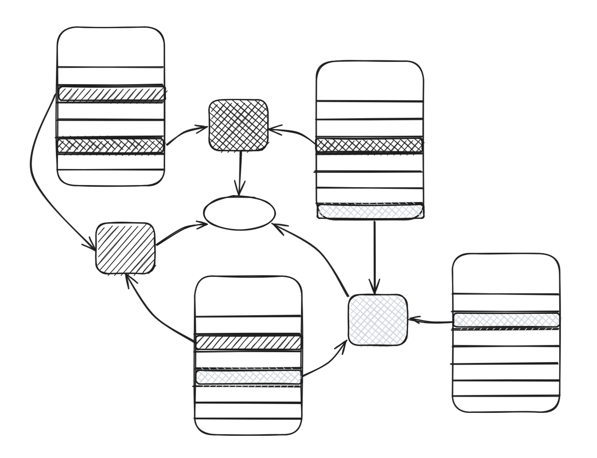

# rhizome

A rhizomatic Zettelkasten system to build off existing knowledge and synthesize new connections

- from a disconnected set of notes, divide each note into chunks 
- embed each chunk and add context enrichment
- construct atomic, self-contained *nomads* of related ideas across chunks
- construct *assemblages* of nomads to form new connections

## Requirements

- a folder of notes 
- install rhizome python CLI
- a running [R2R server](https://r2r-docs.sciphi.ai/introduction)

## Motivation

All of this is motivated by the fear that I'll write the same thing in my notes twice, miss an important connection, or impose an artificially skewed structure on my notes. Therefore, I decided to cultivate a personal knowledge management system that does the following:

> passively atomizes heterogenous, unstructured notes

Why spend my time doing what I could have automated? Instead of manually defined backlinks in a PKM system, assign them using embedding similarity

> actively synthesizes new connections

Again, instead of relying on manual, human-assigned connections, let embedding models make them in the background.

> enables writing with a contextual foundation

Creating a rhizomatic machine that takes a given piece of context, searches through an embedding space, and returns related ideas alleviates the fear of writing the same idea again.
