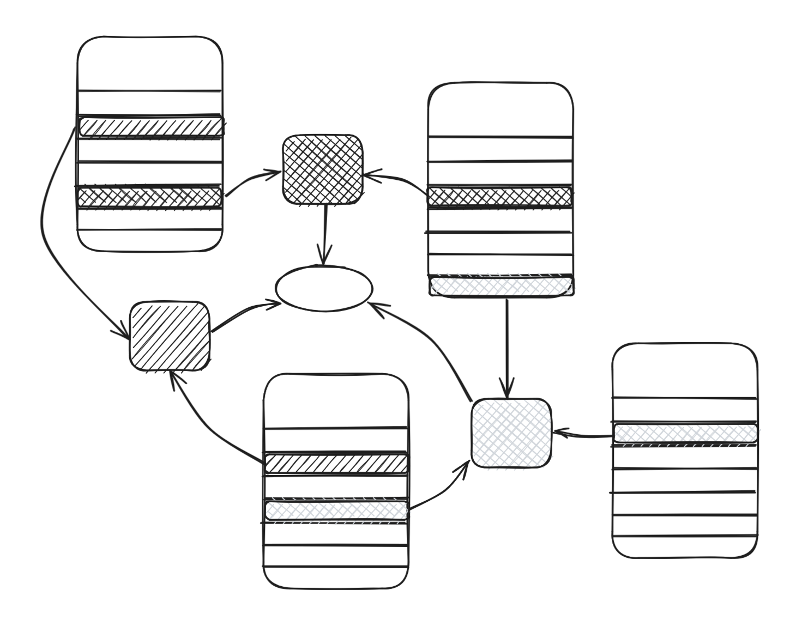

# rhizome

A rhizomatic Zettelkasten system that atomizes notes and synthesizes connections using local LLMs



## Motivation

All of this is motivated by the fear that I'll write the same thing in my notes twice, miss an important connection, or impose an artificially skewed structure on my notes. Therefore, I decided to cultivate a personal knowledge management system that does the following:

> passively atomizes heterogenous, unstructured notes

Why spend my time doing what I could have automated? Instead of manually defined backlinks in a PKM system, assign them using embedding similarity

> actively synthesizes new connections

Again, instead of relying on manual, human-assigned connections, let embedding models make them in the background.

> enables writing with a contextual foundation

Creating a rhizomatic machine that takes a given piece of context, searches through an embedding space, and returns related ideas alleviates the fear of writing the same idea again.

## A note on LLMs

While this idea was something I had a few years ago, I've relied on vibe coding (specifically, Claude Sonnet 4.5 with VSCode + Copilot) to build this system. I've looked through the code enough to feel confident using this on my own device, but please check it yourself.

## Quick Start

### Prerequisites

Rhizome requires two Ollama models:
- **LLM Model** (text synthesis): `deepseek-r1:8b`
- **Embedding Model** (similarity search): `embeddinggemma`

1. **Install Ollama**: Download from [ollama.ai](https://ollama.ai)
2. **Pull the models**:
   ```bash
   ollama pull deepseek-r1:8b
   ollama pull embedding-gemma
   ```
3. **Start Ollama**: `ollama serve` in a terminal

### Installation & Usage

```bash
# Install rhizome-cli from PyPI
pip install rhizome-cli

# Process your notes
rhizome -i your_notes_folder
```

See [USAGE.md](USAGE.md) for detailed instructions and options.

## Output Structure

```
output/
├── chunks/          # Atomic ideas from your notes
│   ├── chunk-1.md  # type: chunk, source: [[original-file.md]]
│   └── chunk-2.md
└── plateaus/        # Connected ideas across chunks
    └── knowledge-synthesis.md  # type: plateau, synthesized content
```
